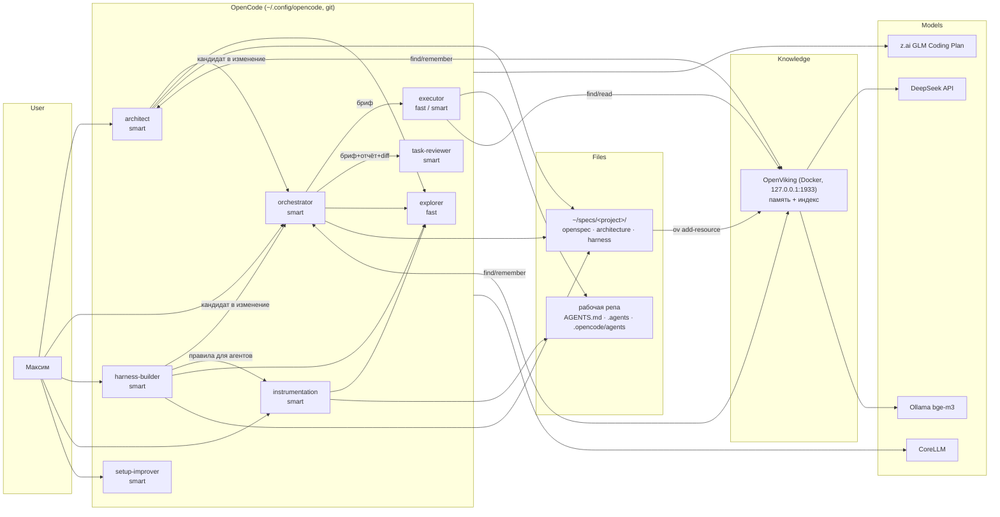
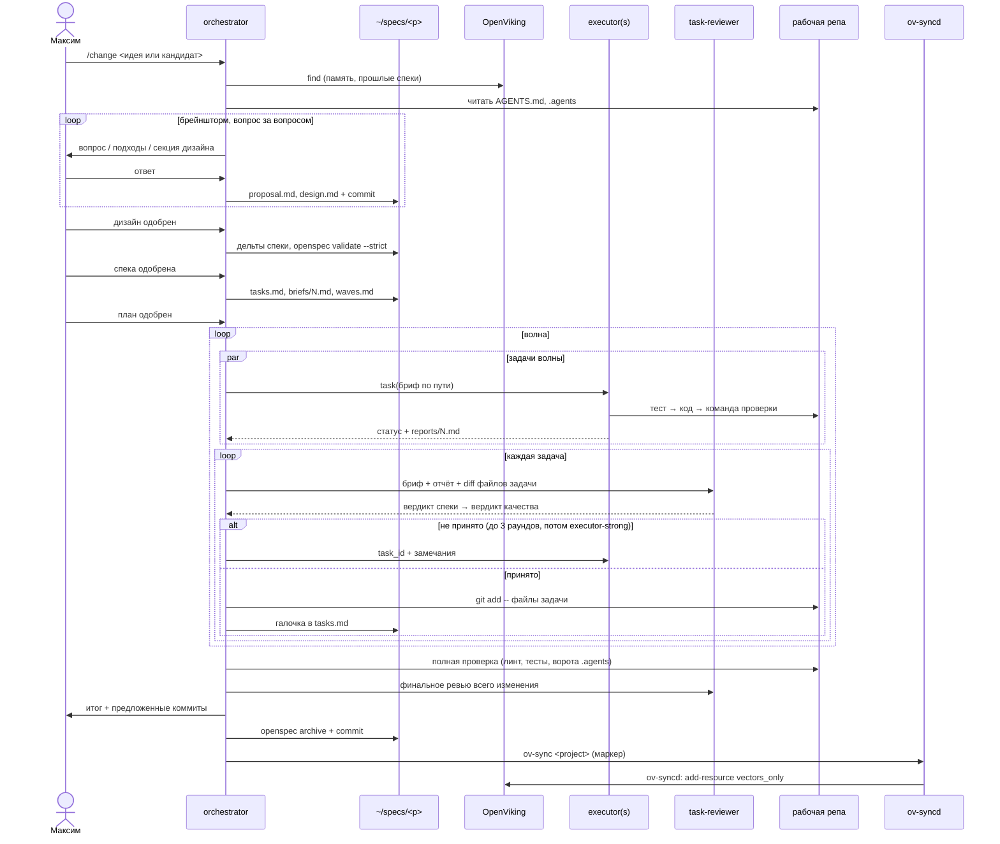

# Архитектура агентского сетапа OpenCode

Дата дизайна: 2026-09-13. Статус: реализовано в `~/.config/opencode`, находки сборки и финального ревью — раздел 13a.
Версии на момент дизайна: OpenCode 1.18.30, OpenSpec CLI 1.6.0, OpenViking 0.4.19.

## 1. Зачем и что меняем

Текущий сетап (OpenCode + Magent + superpowers-плагин + basic-memory) сносится целиком и собирается с нуля.

Причины, подтверждённые замером по логам сессий Magent SDD (`~/.claude/projects`, август–сентябрь 2026):

- фаза плана тяжёлого изменения занимала 2.5–8 активных часов; `magent_plan` вызывался 4–16 раз на изменение, `specify` до 31, `checkpoint` до 116 за сессию;
- стор регулярно отклонял вызовы: невалидные UUID в `operation_id`, пропущенные поля, ловушка `capability_purpose`, `database_error` из-за дрейфа схемы;
- исполнение строго последовательное: 11–35 исполнителей на изменение, отдельные субагенты до 103 минут;
- ревью на соответствие спеке запускалось не на каждую задачу.

Принципы нового сетапа:

1. Минимум своего кода. Инструкции, конфиг и короткие скрипты. Прошлый HarnessKit (`bank/ai-platform`, 18 пакетов Go) показал, куда ведёт обратное.
2. Open source не подключаем напрямую. Берём практики, копируем и адаптируем, фиксируем версию и коммит источника.
3. Источник истины — файлы. Никакого стора между человеком и работой.
4. Осознанный вход: в каждый процесс заходишь, выбрав агента. Никаких автоматических подмешиваний в каждую сессию.
5. Весь конфиг (промпты, скиллы, правила, AGENTS.md) пишется на английском. Общение с пользователем — на русском.

## 2. Общая схема



## 3. Где что лежит

| Место | Содержимое | Git |
|---|---|---|
| `~/.config/opencode/` | `opencode.json`, `tiers/`, `prompts/`, `skills/`, `commands/`, `bin/agents-lint`, `AGENTS.md` | личная репа сетапа |
| `~/.config/opencode/kits/workspace/` | кит workspace: дерево, которое `bin/workspace-kit` копирует в командные workspace; версия в `kits/workspace/kit.json` | личная репа сетапа |
| `~/specs/<project>/openspec/` | `specs/`, `changes/<slug>/` (proposal, design, specs-дельты, tasks.md, briefs/, reports/, waves.md), `changes/archive/` | личная репа спек, в рабочие репы не попадает |
| `~/specs/<project>/architecture/` | `adr/`, `diagrams/` (Mermaid), `roadmap.md`, `backlog/`, `poc/<slug>/` (README с гипотезой, код, `RESULT.md` с цифрами) | та же личная репа |
| `~/specs/<project>/harness/` | `profile.md`, `error-background.md`, `gates.md` | та же личная репа |
| рабочая репа | `AGENTS.md` (≤100 строк, оглавление), `.agents/rules/`, `.agents/skills/`, `.agents/agents/`; `.opencode/agents` и `.opencode/skills` — симлинки в `.agents/` | как решит команда |
| `~/.openviking/` | данные OpenViking, env-файл с ключом DeepSeek (chmod 600) | нет |

Проверено в исходниках OpenCode 1.18.30: проектных агентов он ищет только в `.opencode/agent(s)/` (`config/agent.ts:13`, `config/paths.ts:29`), скиллы читает и из `.agents/skills/` (`skill/index.ts:22`). Папку `.agents/agents/` OpenCode не видит.

Содержимое проектной инструментации лежит нейтрально в `.agents/`. Переходник под этот сетап — закоммиченный тонкий `.opencode/` с симлинками `agents → ../.agents/agents` и `skills → ../.agents/skills`. Тиммейты на других харнесах при желании делают свои папки-переходники тем же способом, сетап их не обслуживает.

Проверено 2026-09-13 на тестовой репе:
- агента из `.agents/agents` через закоммиченную симлинку `.opencode/agents` OpenCode видит (`opencode debug agent`);
- frontmatter агентов в `.agents` должен быть валиден для OpenCode: `tools: Read, Grep` строкой делает весь конфиг невалидным и OpenCode не стартует, `model: sonnet` превращается в несуществующего провайдера `sonnet`;
- скилл из `.agents/skills` в тесте не нашёлся, хотя `skill/index.ts:197` сканирует `.agents` от папки до корня репы. Работает ли `.opencode/skills` через симлинку — спайк S5.

## 4. Агенты

| Агент | Режим | Tier | Может вызывать | Правит | Назначение |
|---|---|---|---|---|---|
| `architect` | primary | smart | explorer | `~/specs/<p>/architecture/**` включая `poc/`; временный worktree для PoC | система целиком: ADR, C4 и sequence в Mermaid, версии, роадмап, бэклог кандидатов, proof of concept с цифрами |
| `orchestrator` | primary | smart | executor, executor-strong, task-reviewer, explorer | `~/specs/<p>/openspec/**` | одно изменение от брейншторма до архива |
| `executor` | subagent, hidden | fast | — | рабочая репа, файлы из брифа | задача с готовым каркасом кода или на 1–2 файла |
| `executor-strong` | subagent, hidden | smart | — | рабочая репа, файлы из брифа | задача по текстовому описанию; эскалация после 3 неудачных раундов |
| `task-reviewer` | subagent, hidden | smart | — | ничего | ревью задачи: два вердикта |
| `explorer` | subagent | fast | — | ничего | чтение и поиск по коду |
| `harness-builder` | primary | smart | explorer | `~/specs/<p>/harness/**`, временный worktree с пробами | фон ошибок и ворота |
| `instrumentation` | primary | smart | explorer | `AGENTS.md`, `.agents/**` и симлинки `.opencode/{agents,skills}` проекта | специализированные под проект правила, скиллы и агенты |
| `workspace-builder` | primary | smart | explorer | файлы целевого workspace | создание и расширение командных workspace через скиллы `workspace-create` и `workspace-extend` |
| `setup-improver` | primary | smart | explorer | `~/.config/opencode/**` | улучшение самого сетапа |

Встроенные `build` и `plan` OpenCode остаются для обычной работы вне процессов.

Общие ограничения для всех агентов:

- в рабочей репе никто не коммитит без просьбы; оркестратор фиксирует принятые задачи через `git add -- <файлы>`;
- субагенты не вызывают других субагентов (`subagent_depth` = 1 по умолчанию, `task` у них deny);
- `task-reviewer` не получает инструменты OpenViking, судит только по брифу и diff.

## 5. Процессы

### 5.1 Архитектор

Вход — выбор агента `architect`. Работает с проектом на уровне системы: исследует код через `explorer`, ведёт ADR (с отвергнутыми вариантами), диаграммы, роадмап. Выход для исполнения — карточка-кандидат в `architecture/backlog/` (цель, контекст, ссылки на ADR и диаграммы). Спеки изменений и задачи не пишет. В `docs/` рабочей репы переносит схемы только по явной просьбе.

Proof of concept. Когда гипотезу можно проверить цифрами (модель данных новой БД, тул потоковой репликации) и вы согласились проверять, архитектор сам пишет и гоняет PoC:

1. `poc/<slug>/README.md` — гипотеза и критерий успеха, записанные до запуска (например, «p95 чтения < 5 мс на 10 млн строк»).
2. Код PoC в `poc/<slug>/`: схема, сидер, бенчмарк, прототип. Запуск только локально (docker compose, testcontainers); если нужен код рабочей репы — временный git worktree; stage и prod — только по явному разрешению.
3. `poc/<slug>/RESULT.md` по шаблону: окружение и версии, точные команды, таблица сырых цифр, вердикт (подтверждено / опровергнуто / не ясно), ссылка на ADR.
4. Цифры идут в ADR как обоснование, `RESULT.md` синхронизируется в OpenViking.
5. Код PoC не переносится в продукт: для реализации архитектор выпускает кандидата в изменение.

### 5.2 Оркестратор



Гейты человека: дизайн, спека, план, эскалации, итог. Между ними оркестратор не останавливается.

Правила волн:

- в одной волне файлы задач не пересекаются; для Go — ещё и пакеты;
- задача рассчитана на 2–10 минут, у исполнителя лимит `steps`;
- Flash (`executor`) получает задачу только с готовым каркасом кода в брифе или на 1–2 файла, остальное — `executor-strong`;
- параллельность ограничена числом в конфиге, по умолчанию 3.

Ревью: один `task-reviewer`, два вердикта по порядку. Сначала соответствие брифу и спеке; при несоответствии качество не оценивается. Отчёту исполнителя ревьюер не верит, читает diff сам. Отдельно проверяет правило о комментариях в коде.

Итеративность: если исполнение показало ошибку в спеке, оркестратор останавливает волну, правит дельту, валидирует, спрашивает и перепланирует оставшиеся задачи.

Восстановление после компакции или новой сессии: `openspec status --json`, галочки в `tasks.md`, `reports/`, индекс git. Отдельного сайдкара нет.

### 5.3 Харнес-билдер

1. Профиль сервиса: тип, критичность (деньги, ПД, 115-ФЗ), нагрузка, интеграции, существующие ворота.
2. Фон ошибок: fix-коммиты и откаты, горячие файлы, флаки, отказы ревьюера из `reports/` архивных изменений, память.
3. Уточняющие вопросы по одному: SLO, нагрузка, что считается зелёным, бюджет минут CI.
4. Пробы: пробные тесты на подозрения в отдельном `git worktree` во временной папке, только локально (docker compose, testcontainers).
5. Выбор ворот по матрице. Каждые ворота: класс ошибок, доказательство, цена, команда, подсказка по исправлению в тексте ошибки.
6. Выход: `harness/*.md` и кандидаты в изменения для оркестратора. Код ворот сам не пишет.
7. Переоценка после нескольких архивных изменений; ворота, которые ничего не ловят, — кандидаты на удаление.

| Профиль | Ворота | Не делаем |
|---|---|---|
| Микрофронт | typecheck, lint с кастомными правилами, контракт с OpenAPI бэкенда, компонентные и визуальные тесты | нагрузку |
| BFF, сервис с низкой нагрузкой | контрактные тесты, интеграционные на testcontainers, кастомный статлинт | нагрузку и мультиинстанс |
| Высоконагруженный или конкурентный (machine-sdk, консьюмеры, платежи) | всё выше + тесты на N инстансов с общим Postgres, нагрузка с порогами, race detector | — |
| Деньги, ПД, 115-ФЗ (надстройка) | линт секретов и ПД в логах, тесты аудита | — |

### 5.4 Агент инструментации (проект)

1. Инвентаризация `AGENTS.md`, `.agents`, `.opencode`. Агентов и скиллы, лежащие прямо в `.opencode/`, агент предлагает перенести в `.agents/` и заменить симлинками.
2. `agents-lint`: имя и длина описания, SKILL.md ≤500 строк, ссылки не глубже одного уровня, у кодового скилла есть `templates/`, упомянутые пути и команды существуют, frontmatter агентов валиден для OpenCode (нет `tools`, `model` только `provider/model`), симлинки `.opencode/{agents,skills}` на месте и не битые.
3. Смысловой аудит по чек-листу вредного: раздутый AGENTS.md, правило без проверки, правило против кода, дубли и противоречия, привязка ко времени, описание скилла пересказывает процесс, агент без description или mode, правило, которое должно быть линтом (передаётся харнес-билдеру).
4. Новое правило или скилл — только если класс ошибки повторился хотя бы 2 раза.
5. Вопросы по одному, diff на одобрение, без коммита.

Шаблон скилла:

```
.agents/skills/<name>/
  SKILL.md       # name, description "Use when…" (≤1024); body ≤500 lines
  templates/     # обязательно, если скилл про код; из реального кода репы (путь + коммит)
  scripts/       # опционально
```

При создании кодового скилла агент генерирует пример по шаблону во временном worktree и собирает его. Не собирается — скилл не создаётся.

### 5.5 Setup-improver (сам сетап)

Отдельный primary-агент, скилл `opencode-config-improver`:

- дрейф OpenCode: changelog новой версии против конфига (устаревшие ключи, новые возможности);
- дрейф источников: изменения в апстриме портированных частей с зафиксированного коммита (superpowers, humanizer, форматы OpenSpec); ничего не подтягивает сам;
- метрики флоу: долгие субагенты, частые отказы ревьюера по одной причине, повторные вызовы;
- изменения промптов оркестратора и ревьюера помечаются рискованными и требуют смоук-прогона.

### 5.6 Сброс сессий и восстановление контекста

Зачем: 80–94% стоимости сессии — повторное чтение накопленного контекста. Сброс контекста оркестратора на гейтах удешевляет каждый следующий вызов и растягивает квоту z.ai.

Свой плагин `session-reset` в репе сетапа, ~100–150 строк, фиксированный, без внешних зависимостей:

- работает только в сессиях `orchestrator` и `architect`, в остальных ничего не делает;
- на гейте (спека, план, конец волны) оркестратор вызывает тул плагина `phase_reset`, и сессия компактится (`POST /session/{id}/summarize`);
- хук `experimental.session.compacting` добавляет в сводку состояние изменения из файлов: `openspec status --json`, незакрытые задачи из `tasks.md`, задачи с отчётом без вердикта, текущую волну, плюс 3–6 фактов из OpenViking по slug изменения в пределах бюджета токенов из конфига;
- на событии `session.compacted` отправляет в OpenViking только сводку компакции, без сырых сообщений и вывода тулов;
- автокомпакция OpenCode (`compaction.auto`) проходит через тот же хук, восстановление одинаковое;
- если плагин или OpenViking недоступны, работает восстановление из файлов (раздел 5.2).

Проверено в исходниках OpenCode 1.18.30: хук `experimental.session.compacting` принимает `output.context[]` и `output.prompt`, событие `session.compacted` публикуется в `session/compaction.ts:554`, эндпоинт `summarize` есть в SDK.

Из официального плагина OpenViking взяты две идеи: порог в токенах перед фиксацией сессии и бюджет на восстанавливаемый контекст.

## 6. OpenViking

- Роль: производный индекс (ADR-005, `~/specs/opencode/architecture/adr/005-memory-as-derived-index.md`) для памяти (предпочтения, обратная связь, проектные ограничения, ссылки) и для спек, архитектуры, `.agents`. Источник истины: файлы `~/specs` и их git-история; индекс можно снести и пересобрать без потерь. Спеки в нём не живут.
- Развёртывание: Docker, фиксированная версия, `127.0.0.1:1933`, данные в `~/.openviking`. Обновление только после чтения changelog.
- Модели: эмбеддинги `bge-m3` через локальный Ollama; LLM для сводок и извлечения памяти: `deepseek-flash` (DeepSeek-V4.1-Flash) через `https://api.deepseek.com`.
- Подключение: MCP `http://127.0.0.1:1933/mcp`. Плагин `@openviking/opencode-plugin` в v1 не ставится.
- Синхронизация запускается только на гейтах (принятый архитектурный документ, принятый результат PoC, одобренная спека, одобренный план, конец волны, архив, принятая оценка harness), не после каждого коммита. Гейт вызывает `bin/ov-sync <project>`: тот кладёт маркер в `~/.openviking/sync-queue/<project>` и выходит с кодом 0 для валидного имени проекта, даже когда OpenViking недоступен (сам Docker команда не трогает); невалидное имя проекта возвращает код 2. `bin/ov-sync --status` печатает по каждому проекту, стоит он в очереди или выполняется, и его последний результат из файла состояния, а `synced=` показывает время последней успешной синхронизации.
- Демон `bin/ov-syncd` работает под LaunchAgent `opencode.ov-syncd`, держит лок `~/.openviking/ov-syncd.lock` и каждые 15 секунд собирает проекты, готовые к синхронизации: маркер старше 90 секунд, либо HEAD ушёл дальше `synced_commit`, а новейший коммит старше 2 минут. Для готового проекта воркер строит зеркало HEAD по allow-листу `openviking/sync-scope` в `~/specs/.ov-stage/<project>` и импортирует его целиком командой `add-resource --processing-mode vectors_only` в `viking://resources/<project>/specs`; это не стоит вызовов LLM, а завершение читается из `ov task list`, а не из кода выхода CLI. Бэкофф растёт только при недоступности OpenViking (60 секунд, удвоение до 30 минут) и при конфликте лока (30 секунд, удвоение до 5 минут); неудачная задача повторяется через 60 секунд, а после трёх неудач подряд автоматические попытки останавливаются до нового коммита или маркера. Задача, не завершившаяся за 15 минут, фиксируется как таймаут, и пока она числится в `ov task list`, новый импорт для проекта не запускается.
- Раз в сутки воркер строит сводки директорий под `architecture/` и директорий с изменившимся `decisions.md` (`reindex --mode semantic_and_vectors`) под дневным бюджетом: не больше 60 оценочных вызовов VLM в план ночи, а как только фактических вызовов набирается 80, новая директория в эту ночь уже не берётся (сутки могут закончиться чуть выше 80). Бюджет дня и счётчик хранятся в `~/.openviking/sync-state/_nightly.json`; занятая очередь откладывает ночь через `retry_after`. В ту же ночь пишется снимок счётчиков сервера в `usage.jsonl`.
- `bin/ov-usage [--days N]` печатает по дням: вызовы VLM, `reindex` (часть `vlm`, отдельно к нему не прибавляется), эмбеддинги, импорты, чтения памяти из логов Claude Code и OpenCode, число строк `Memory:`, из них `used=yes`, и столбец `rederived`: добавленные строки `Rederived:` плюс строки `Memory:`, у которых `rederived` не `none`.
- Журнал решений: первая запись сессии, строка `Memory: query="..." hits=N used=yes|no rederived=none`, пишется один раз с `rederived=none` и не редактируется. Повтор найденного позже решения дописывает отдельную строку `Rederived: <путь>`. Неудачное чтение памяти пишет `hits=0 used=no` в строке `Memory` и следующей строкой `Memory error: <текст>`.
- Восстановление сессии: `bin/change-state` и команда `resume` читают `decisions.md` и `synced_commit` из состояния воркера, затем делают один `find`, ограниченный slug'ом изменения, вместо перечитывания всех файлов; когда `synced_commit` отстаёт от HEAD, побеждают файлы.
- `bin/ov-up` разворачивает шаблоны `openviking/launchd/opencode.ov-studio.plist` и `opencode.ov-syncd.plist`: совпадающий с шаблоном и уже загруженный агент не трогает, для отсутствующего файла или незагруженного агента делает `launchctl bootstrap`, а загруженный агент с изменившимся plist перезагружает через `launchctl bootout` и затем `bootstrap`, а не `kickstart`, который plist не перечитывает. Также добавляет Docker и Ollama в login items, если их там ещё нет.
- Файлы воркера под `~/.openviking/`: `sync-queue/` (маркеры), `sync-state/` (`<project>.json` и `_nightly.json`), `ov-sync.log`, `usage.jsonl`, `ov-syncd.lock`.
- Перенос памяти выборочный: `magent export` + `~/memory` (142 файла), триаж (оставить / переписать / выкинуть), таблица на одобрение, импорт одобренного.
- Ворота до сноса basic-memory: 20 реальных запросов, правильный факт в топ-3 не реже, чем у basic-memory. Не прошло: память остаётся markdown, OpenViking только индекс.
- Известные риски: Alpha и частые ломающие изменения; извлечение памяти (`remember`) вызывает LLM; issue #4482 (поиск по файлам); на локальных LLM извлечение памяти не работает (#4879), поэтому LLM облачная.

## 7. Глобальные конвенции

Коммиты: `type(scope): subject`, английский, повелительное наклонение, нижний регистр, до 72 символов, без тела и трейлеров. Типы: `feat`, `fix`, `refactor`, `test`, `docs`, `chore`, `perf`, `build`, `ci`. Агенты не коммитят без просьбы, оркестратор в конце предлагает список коммитов. Хук `commit-msg` ставится в конкретную репу только по просьбе.

Комментарии в коде: только для неочевидного решения («почему»), либо короткая документация метода в 1–2 строки. Без пересказа кода, без истории «раньше было», без changelog. Подробная документация — только по просьбе.

Длинные тексты: скилл `humanize`, сжатый перенос `blader/humanizer@9862685` (MIT) с русскими штампами. Применяется к ADR, proposal, design, итоговым описаниям, описаниям стори и задач.

## 8. Модели, ключи, подписки

Tier-файлы — единственное место назначения моделей:

```
~/.config/opencode/tiers/smart   → zai-coding-plan/glm-5.3
~/.config/opencode/tiers/fast    → zai-coding-plan/glm-5.3-flash
```

Агенты объявляются в JSON (в markdown-агентах подстановки не работают):

```jsonc
{
  "agent": {
    "executor": {
      "mode": "subagent",
      "hidden": true,
      "description": "Implements one task from a brief file",
      "model": "{file:./tiers/fast}",
      "prompt": "{file:./prompts/executor.md}",
      "steps": 40,
      "permission": { "task": "deny", "bash": { "*": "allow", "env": "deny", "git commit*": "deny", "git * commit*": "deny" } }
    }
  }
}
```

Проверено 2026-09-13: `"model": "{file:./tiers/fast}"` резолвится в `zai-coding-plan/glm-5.3-flash` (`opencode debug agent`).

| Ключ / подписка | Для чего | Где хранится | Примечание |
|---|---|---|---|
| z.ai GLM Coding Plan | модели агентов OpenCode | `opencode auth login` (провайдер `zai-coding-plan`) или env `ZHIPU_API_KEY` | по условиям z.ai — только в поддерживаемых тулах; в OpenViking нельзя |
| CoreLLM | резерв в ротации: `llm-medium` / `deepseek-v4-flash` (DeepSeek V4 Flash), `coder` (GLM-5.3-Flash, вывод ≤8096) | env `CORELLM_TOKEN` | внутренний; токен перевыпустить (засвечен в сессии 2026-09-13) |
| DeepSeek API | только LLM для OpenViking | env-файл в `~/.openviking`, chmod 600 | пополняется вручную; пик 04–07 и 09–13 МСК по будням дороже вдвое |
| Ollama `bge-m3` | эмбеддинги OpenViking | локально | без ключа |
| OpenAI | в v1 не используется | `~/.local/share/opencode/auth.json` | решить при сносе |

Данные: код и контекст рабочих реп уходят к провайдеру модели агента (z.ai); память и сводки спек — в DeepSeek. Для банковского кода нужно согласие ИБ.

## 9. Как расширять

### 9.1 Новый API в ротацию

1. Добавить провайдер в `opencode.json`:

```jsonc
"provider": {
  "new-api": {
    "npm": "@ai-sdk/openai-compatible",      // или "@ai-sdk/anthropic"
    "name": "New API",
    "options": { "baseURL": "https://…/v1", "apiKey": "{env:NEW_API_KEY}" },
    "models": {
      "some-model": { "name": "Some Model", "limit": { "context": 256000, "output": 32000 } }
    }
  }
}
```

2. Положить ключ в env-файл сетапа (chmod 600), не в `opencode.json`.
3. Проверить: `opencode models new-api`.
4. Переназначить: записать `new-api/some-model` в `tiers/fast` или `tiers/smart`.
5. Проверить: `~/.config/opencode/bin/oc-agent executor` (печатает только агент, режим и модель; `opencode debug config` не использовать — он печатает раскрытые секреты), затем смоук-сценарий.

### 9.2 Новый tier

Создать `tiers/<name>`, сослаться на него из нужного агента: `"model": "{file:./tiers/<name>}"`.

### 9.3 Точечное переопределение

У конкретного агента вместо `{file:…}` указать модель строкой. Использовать редко: теряется единая точка переключения.

### 9.4 Консоль назначения моделей (после смоука)

Локальный сервер на htmx, ~150–200 строк: список провайдеров и моделей из `opencode models`, текущие tier-файлы, выпадающий список для переназначения, запись в tier-файл и коммит в репу сетапа. Логики нет, только правка tier-файлов и провайдеров.

## 10. Раскатка

| # | Шаг | Готово, когда |
|---|---|---|
| 0 | tar-бэкап `~/.config/opencode`, перевыпуск `CORELLM_TOKEN` | архив есть, токен новый |
| 1 | репа `~/setup-opencode` (после сборки перенесена в `~/.config/opencode`), запуск через `OPENCODE_CONFIG_DIR` | `bin/oc-agent orchestrator` верен |
| 2 | спайки S1–S4 | каждый дал ответ или обход |
| 3 | каркас: `opencode.json`, `tiers/`, промпты, `AGENTS.md` | `agents-lint` зелёный |
| 4 | перенос скиллов, `agents-lint` | lint зелёный, у каждого скилла источник и коммит |
| 5 | смоук-изменение на песочной репе | метрики ниже |
| 6 | OpenViking + перенос памяти | ворота поиска пройдены |
| 7 | переключение на новую `~/.config/opencode` | запуск без переменной работает |
| 8 | первое реальное изменение, харнес-билдер на сервисе с низкой нагрузкой | отчёт по времени |
| 9 | htmx-консоль моделей | переназначение tier из браузера |

Спайки:

- S1: `edit` + `external_directory` пускают оркестратор только в `~/specs` (в исходниках правка сверяется с путём относительно рабочей репы, внешняя папка — отдельным правом `external_directory`);
- S2: GLM-5.3 через z.ai делает несколько вызовов `task` в одном сообщении (на этом держатся волны; обход — команда, отправляющая брифы по одному);
- S3: `openspec validate/archive` из `~/specs/<p>`, пока OpenCode открыт в рабочей репе;
- S4: OpenViking с `deepseek-flash` извлекает память, `bge-m3` ищет по-русски;
- S5: OpenCode находит скиллы через закоммиченную симлинку `.opencode/skills → ../.agents/skills` (агенты через `.opencode/agents` уже проверены);
- S6: оркестратор изнутри хода компактит свою сессию через тул плагина и продолжает с состоянием из хука. Если нельзя — гейт завершает ход, компакцию запускает команда `/reset`, следующее сообщение продолжает.

Смоук-изменение: песочная репа, 4 задачи (две параллельные, одна с нарочно неполной реализацией, одна с готовым кодом для Flash). Проверяется: ревьюер ловит нарушение, исполнитель не коммитит и не выходит за файлы, восстановление после компакции, время. Цель для маленького изменения: план меньше 30 активных минут, исполнение меньше часа.

## 11. Сбои

| Сбой | Реакция |
|---|---|
| исполнитель `BLOCKED` / `NEEDS_CONTEXT` | оркестратор дополняет бриф или спрашивает |
| кончилась 5-часовая квота z.ai | волна останавливается с отчётом; ждать или переключить tier на CoreLLM / DeepSeek |
| OpenViking недоступен | работа без памяти, предупреждение в начале сессии |
| исполнитель тронул чужой файл | ревьюер отмечает выход за рамки, откат только с согласия |
| компакция / новая сессия | восстановление из файлов и индекса git |

## 12. Что не входит в v1

- внешний раннер поверх `opencode serve` с worktree на исполнителя (вернуться, если волны упрутся в пересечения файлов);
- официальный плагин OpenViking для OpenCode (вместо него свой `session-reset`, раздел 5.6);
- глобальный `commit-msg` хук;
- tier `deep` для архитектора;
- Serena, Playwright, actionbook, context7, basic-memory, плагин superpowers;
- обновление кита, repo-kits, трекер и статус для workspace builder: следующие изменения workspace-kit-update (обновление кита по штампу), workspace-repo-kits (repo-kits bff и mfe) и workspace-tracker-status (трекер и статус).

## 13. Отвергнутые варианты

| Вариант | Почему нет |
|---|---|
| Спеки в рабочих репах (коммитом или под .gitignore) | спеки — личная кухня, в рабочие репы не попадают |
| Всё, включая спеки, внутри OpenViking | LLM на каждую правку, устаревший индекс у субагентов, резка markdown, Alpha; стор снова между человеком и работой |
| Внешний раннер в v1 | это код; путь, по которому разросся HarnessKit |
| Два ревьюера на задачу | дороже и дольше; superpowers от этого отказался; в замерах spec-review и так запускался не всегда |
| Режим архитектора внутри оркестратора | раздутый промпт на два процесса, теряется осознанный вход |
| Харнес-билдер сам пишет ворота | ворота попадали бы в репу без спеки и ревью |
| Улучшение сетапа как режим агента инструментации | нужен отдельный осознанный вход |
| Агенты и скиллы проекта прямо в `.opencode/` | содержимое привязано к одному харнесу; вместо этого `.agents/` плюс симлинки |
| Локальный незакоммиченный переходник (`.git/info/exclude`) | лишний шаг после каждого клона; закоммиченные симлинки работают сразу |
| Официальный плагин OpenViking для сброса и восстановления | подмешивает память во все сессии, пишет дословный вывод тулов (банковский код уходит в DeepSeek), ~5 800 строк чужого кода |
| Сброс сессий только инструкциями (`handoff.md` + ручной `/resume`) | сброс руками на каждом гейте, экономия контекста зависит от дисциплины |
| PoC через исполнителей по брифам | гипотеза меняется по ходу, брифы и ревью тормозят итерации |
| Плагин superpowers как есть | подмешивает вводную в каждую сессию, пишет свои спеки в `docs/superpowers` |
| LLM OpenViking: CoreLLM / z.ai API / OpenAI | выбран собственный ключ DeepSeek |
| Ключ подписки z.ai в OpenViking | запрещено условиями Coding Plan |

## 13a. Что выяснилось при сборке (2026-09-13)

- **Как OpenCode проверяет bash (исходники 1.18.30).** Команда разбирается tree-sitter на отдельные команды, каждая сверяется со своими правилами вместе с редиректами; решает последнее совпавшее правило, `*` проходит через пробелы и `/`. Отсюда правила:
  - read-only allow-лист у primary-агентов, в конце — `ask` на запись (`*>*`, `* --output*`, `find -exec/-delete`, `sort -o`, `rg --pre`, `go env -w`…), `sed`, `awk`, `xargs`, `git -C` не разрешены;
  - в конце всех агентов `deny` на `env`, `printenv`, `*.env`, `git commit*`, `git * commit*`, `git * push*`; у исполнителей bash открыт, запреты — страховка, итог проверяет неподвижный HEAD;
  - `~/` в шаблоне OpenCode разворачивает в домашний путь, а текст команды хранит `~`, поэтому скрипты разрешены парой `?/.config/opencode/bin/<script> *` и `~/.config/opencode/bin/<script> *`; якорь в начале не даёт подставить путь подстрокой;
  - `IFS=*` не разрешать: `IFS=x rm -rf y` совпал бы целиком;
  - read-only команды можно с `2>/dev/null` и `2>&1`, вторая стрелка (`*>*>*`) снова спрашивает: модели постоянно глушат stderr, а `ask` в `opencode run` отклоняется и обрывает ход;
  - глобальное `read: allow` перекрывало штатный `ask` на `.env`, теперь `*.env` и `*.env.*` запрещены.
- **Правки вне репы.** Шаблон edit считается от рабочей репы: оркестратор `../*specs/*`, ревьюер `../*specs/*/reports/*`, архитектор и харнес — свои подпапки. Без `../` правило совпадало с `internal/specs/...` внутри репы. setup-improver: `*` allow и `../*` deny, запускать из `~/.config/opencode`.
- **Коммиты спек.** Единственный путь — `bin/specs-commit <project> '<message>'`: проверяет имя проекта и сообщение, коммитит только корень репы `~/specs/<project>`.
- **Отчёты задач append-only.** Исполнитель дописывает `## Attempt <n>`, ревьюер — `## Review round <n>` с вердиктом. `change-state` сравнивает номер последней попытки с числом вердиктов: попыток больше — `awaiting_review`, иначе решает последний вердикт (`needs_fix` или `ready_to_accept`). Позиции в файле не годятся: исполнитель на смоуке переписал отчёт и поставил `## Attempt 2` наверх.
- **Смоук доказывает отказ ревьюера.** Задача 1.5 приходит уже сделанной без сценария `inverted range` (`smoke/pending`), отчёт без вердикта. Проверка требует `Verdict: NOT COMPLIANT` хотя бы в одном отчёте и два коммита в репе спек. На прогоне 2026-09-13 ревьюер отклонил 1.5, исполнитель дописал сценарий, второй раунд — COMPLIANT.
- **Память.** На 18 ГБ с занятым swap Claude Code снимал фоновый смоук. `bin/smoke-run --continue` продолжает прерванный прогон из `/tmp/opencode-smoke` той же сессией.
- **Смоук и OpenViking.** `~/specs/opencode-smoke` (симлинк на `/tmp`) воркер `ov-syncd` пропускает: due-проекты отбираются только среди директорий под `specs`, которые не являются симлинками. Обычные проекты, лежащие прямо в `~/specs`, синхронизируются как всегда; смоук память не засоряет.
- **Финальный смоук 2026-09-13: PASS.** 5/5 задач, 2 отказа ревьюера и 2 раунда исправлений, продолжение после `phase_reset`, HEAD рабочей репы не сдвинут, архив `2026-09-13-smoke-change`, коммит спек через `specs-commit`, пик памяти opencode 685 МБ.
- **Волны (S2).** GLM-5.3 отправляет несколько вызовов `task` в одном сообщении, субагенты работают параллельно.
- **Проектные агенты и скиллы (S5).** Работают через закоммиченные симлинки `.opencode/agents` и `.opencode/skills`; скиллы также находятся нативно в `.agents/skills`. Временные папки в `/var` ломают поиск проекта (`/private/var`), тестировать только под `$HOME`.
- **OpenViking.**
  - Эмбеддинги Ollama подключаются как OpenAI-совместимый провайдер: `"provider": "openai", "api_base": "http://host.docker.internal:11434/v1"`. Провайдер `ollama` бьёт в `/embeddings` и получает 404.
  - Корневой ключ не читает и не пишет данные. Создан аккаунт `maxim` (`ov admin create-account maxim --admin maxim --sudo`), пользовательский ключ лежит в `~/.openviking/.env` как `OPENVIKING_API_KEY`. MCP в `opencode.json` читает его из `~/.openviking/mcp-key` (600, пишет `bin/ov-up`) через `{file:}` и с `"oauth": false`: переменная из `.zshrc` не видна OpenCode, запущенному не из интерактивного shell, пустой Bearer давал 401 и уведомление «нужно залогиниться».
  - Посмотреть память: `bin/ov-studio` поднимает Studio на `http://127.0.0.1:1934/studio` и подставляет пользовательский ключ на своей стороне, в браузер ключ не попадает; запросы с чужим `Origin` отклоняются. Главная страница Studio показывает нули: статистика требует ключ админа. Данные — в Playground, дерево `viking://`.
  - Плагин сброса писал сводки в `viking://user/memories/sessions` с `mode: upsert`, сервер отвечал `INVALID_URI` и `unsupported write mode`, ошибка глоталась. Теперь URI `viking://user/<user>/memories/sessions/<id>.md` (пользователь из `/api/v1/system/status`), режим `replace`, ключ из `~/.openviking/mcp-key`, сбой пишется в лог.
  - `ov` CLI в контейнере требует `ov language en` и конфиг `ov config add custom --name user --url http://127.0.0.1:1933 --api-key-stdin --activate`.
  - Повторный `ov add-resource ... --to <тот же uri>` переиндексирует без ошибок: на этом факте держится синхронизация `ov-syncd`, которая запускает эту команду один раз за проект, когда он становится due, а не на каждом 15-секундном тике; `bin/ov-sync` только кладёт маркер в очередь.
- **Serena** удалена из живого конфига по просьбе.
- **Проверка модели агента:** `bin/oc-agent <agent>`.
- **Claude Code.** `bin/claude-link` подключает сетап в `~/.claude`, повторный запуск безопасен и чужие файлы не трогает:
  - `CLAUDE.md` → `AGENTS.md`, скиллы и команды симлинками; поле `agent:` в командах Claude Code игнорирует, поэтому `/change` запускать внутри `claude --agent orchestrator`;
  - агенты генерируются из `opencode.json` и `prompts/` с меткой, модели: smart → opus, fast → sonnet; у explorer и task-reviewer узкий список tools;
  - `settings.json`: плагины magent, magent-lang, humanizer выключены; хук `SessionStart` (matcher `compact`) запускает `bin/claude-change-context` вместо `phase_reset`; deny на `.env`, `printenv`, `env`, `opencode debug config`;
  - MCP OpenViking в user scope с `headersHelper` = `bin/ov-mcp-headers`, ключ не хранится в `~/.claude.json`;
  - права OpenCode в Claude не переносятся: там свой синтаксис и первый совпавший deny.
- **Модель по умолчанию.** `model` и `small_model` = `{file:./tiers/fast}`. Без них OpenCode брал последнюю модель из `~/.local/state/opencode/model.json` (там был Gemini Flash), а заголовки сессий генерировал чужой провайдер. `bin/oc-agent build` показывает `None`, потому что у build нет своей модели; фактическую модель видно в логе (`llm.model=`).
- **PoC архитектора.** Кроме Go, Python и Node разрешены `cargo`, `rustc`, `rustup show` и `zig`; вывод в файл по-прежнему спрашивает.

## Workspace builder

Кит командного workspace лежит в `kits/workspace/`. Это дерево повторяет созданный workspace файл в файл. `kits/workspace/kit.json` хранит `name`, `version` и `templated`; версия кита записывается в каждый созданный workspace.

`bin/workspace-kit create` копирует кит в целевую папку и подставляет значения в шаблонные файлы из `templated`. Агент `workspace-builder` (primary, smart) создаёт и расширяет workspace через скиллы `workspace-create` и `workspace-extend` и правит только файлы целевого workspace.

В workspace есть `AGENTS.md`, `.agents/` с ролями, правилами, скиллами и шаблонами, сгенерированные переходники под харнесы, `tools/check.py` и `tools/generate.py` и личный слой `.local/`. Скрипты работают на стандартной библиотеке Python 3.9 без зависимостей.

CI в ядро не входит. Для работы без Python в скиллах есть рецепты с ручными шагами. Каждый merge request мёрджит человек.

Тесты: `tests/test_workspace_*.py`, `tests/workspace-kit.test.mjs` и `bin/workspace-py39`, который гоняет тесты скриптов workspace в Docker-образе `python:3.9`. Приёмочный прогон `bin/workspace-smoke` пишет результаты в `smoke/WORKSPACE-RESULTS.md`.

Стримы. Стрим лежит в `domains/<domain>/streams/<stream>/`: `stream.json` (профиль, стадия, scope, отметки одобрения), `epic.md`, истории `stories/<slug>/story.md`, ручной `MOCKUPS.md` и сгенерированный `BREAKDOWN.md`. Стадии идут по одной: goal → map → decomposition → ready → delivery → done. Стадию меняет design merge request: он ставит новый `stage` и добавляет отметку `{stage, by, date}` для закрываемой стадии, мёрджит его ревьюер. Карта домена состоит из элементов `domains/<domain>/map/<slug>.md` и `domains/<domain>/MAP.md`; в `MAP.md` таблицы экранов и переходов генерируются между маркерами, остальное, включая таблицу `Legacy trace`, пишется руками.

Профили. Профиль задаётся данными, а не кодом: `.agents/profiles/<name>/profile.json` описывает виды элементов, обязательные поля, таблицы, разделы историй и гейты каждой стадии. Гейт называет предикат ядра с параметрами: `approval`, `epic_sections`, `unique_keys`, `two_way_coverage`, `no_dangling_targets`, `legacy_traced`, `tracker_ids`, `no_open_questions`, `work_records`. Новому профилю код не нужен, новому виду гейта нужны код ядра и новая версия кита. В кит входит профиль `ui-migration` в формате PoC operations-map: экраны с таблицей `Transitions`, истории с frontmatter из PoC и трасса legacy в `MAP.md`.

`tools/check.py` проверяет гейты всех закрытых стадий; отметка одобрения нужна только закрытым стадиям goal, map и decomposition, где в профиле есть гейт `approval`, а у ready, delivery и done такого гейта нет. Гейт текущей стадии показывает `python3 tools/check.py --remaining`, команда всегда завершается с кодом 0. Скиллы: `task-new` создаёт историю из шаблона профиля, `task-decompose` предлагает по истории на каждый экран scope без истории и заканчивается merge request с отметкой decomposition, `task-context` собирает контекст по ключу или id трекера через `.agents/index.json`. `extend` умеет виды `stream` и `map-element`.

Нормализация. Режим `normalize` агента `workspace-builder` нужен для существующего репозитория без `.agents/kit.json` и загружает скилл `workspace-normalize`. Для репозитория со штампом `.agents/kit.json`, где в `docs/normalize/plan.md` остались строки `todo` под доменом, агент тоже выбирает `normalize` и выполняет его доменную фазу. Скилл работает только в git worktree от default-ветки и не трогает checkout владельца. Сначала он пишет план `docs/normalize/plan.md` (источник, действие, цель, статус), владелец его утверждает, и только потом что-то меняется. Затем идёт merge request основы (кит, `AGENTS.md`, `repos.json`, ADR, диаграммы) и по одному merge request на домен. Скилл ничего не выдумывает: спорная строка карты становится открытым вопросом со ссылкой на источник, а отметка одобрения без цитаты источника не пишется, и стадия не позже стадии без отметки. Коммитит владелец командами, которые печатает скилл.

`bin/workspace-kit adopt` ставит кит в непустой git-репозиторий. Он копирует отсутствующие файлы, существующие файлы с другим содержимым не перезаписывает и печатает как конфликты, шаблонные файлы не трогает, пишет `.agents/kit.json` и отказывается, если штамп уже есть.

Язык воркспейса задаёт параметр кита `language` в `.agents/kit.json` (по умолчанию `en`). Профиль при загрузке берёт значения на этом языке, языковые шаблоны `<name>.<language>.md` лежат рядом с английскими. У `ui-migration` есть русские значения и шаблоны (`story.ru.md`, `front.ru.md`, `api.ru.md`, «Переходы», «Трасса legacy»). Колонки и заголовок `BREAKDOWN.md` задаёт блок `breakdown` профиля, шаблоны `epic.md` и `MAP.md` лежат в папке профиля. Языки воркспейса появились в версии кита 0.3.0.

Repo-kits. Кит репозитория лежит в workspace в `.agents/repo-kits/<kind>/`, а запись репозитория в `repos.json` выбирает его полем `kit` с `kind` и `params`. `tools/repo_kit.py` умеет `render` (отрисовать кит с параметрами), `status` (сравнить клон с китом и штампом) и `stamp` (записать штамп). Скилл `repo-kit-install` ставит кит в локальный клон, `repo-kit-update` обновляет его по штампу. Оба работают на ветке `repo-kit-<kind>-<version>` и до записи собирают решение по каждому изменённому в клоне файлу: `kit` пишет файл кита, `local` переносит текст клона в `.agents/local/` и пишет файл кита, `raise` останавливает прогон без изменений. Штамп `.agents/kit.json` в репозитории хранит sha256 каждого файла кита. Старую папку `.agent/` установка переносит в `.agents/` через `git mv`. Скиллы не коммитят, а печатают команды коммита, push и merge request. С repo-kits версия кита workspace 0.4.0.

Следующие изменения: `workspace-kit-update` (обновление кита по штампу), `workspace-tracker-status` (трекер, статус и часть гейта done про смёрдженные merge request).

## 14. Источники

- OpenCode: https://opencode.ai/docs (agents, config, providers, skills, permissions, server); исходники тега v1.18.30.
- OpenSpec: https://github.com/Fission-AI/OpenSpec (docs/opsx.md, concepts.md, cli.md).
- superpowers: https://github.com/obra/superpowers (skills/subagent-driven-development, RELEASE-NOTES.md).
- OpenViking: https://github.com/volcengine/OpenViking (docs/en/concepts, agent-integrations/10-opencode.md, issues #4482, #4879, #1595).
- humanizer: https://github.com/blader/humanizer (коммит 9862685).
- Harness engineering: https://martinfowler.com/articles/harness-engineering.html, https://factory.ai/news/using-linters-to-direct-agents, https://www.anthropic.com/engineering/harness-design-long-running-apps.
- Anthropic skills best practices: https://platform.claude.com/docs/en/agents-and-tools/agent-skills/best-practices.
- z.ai GLM Coding Plan: https://docs.z.ai/devpack/overview, https://docs.z.ai/devpack/usage-policy.
- DeepSeek API: https://api-docs.deepseek.com/quick_start/pricing.
- awesome-agent-harness: https://github.com/AutoJunjie/awesome-agent-harness.
